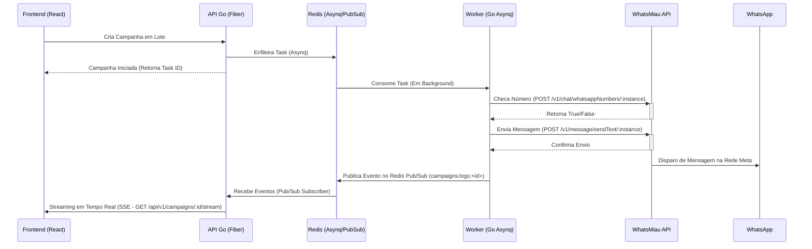

# 🔎 Sherlock Scraper — B2B Lead Management & Campaigns


## 📌 Visão Geral

Sherlock Scraper é um sistema avançado de CRM e prospecção B2B (Business-to-Business) focado na captação automatizada de leads e orquestração de disparos de mensagens via WhatsApp. Combinando raspagem de dados com um motor robusto de campanhas em background, a plataforma garante entregabilidade em alta performance e escalabilidade. O Sherlock orquestra envios em lote integrando-se via REST HTTP com seu provedor de infraestrutura core (WhatsMiau / Evolution API) atuando em contêineres de componentes isolados para prevenir gargalos estruturais e falhas de runtime.

## 🏗️ Arquitetura do Sistema

O fluxo principal de integração de campanhas opera estritamente de maneira assíncrona, assegurando processamento ininterrupto e uma experiência UX altamente fluida (sem telas travadas) no Frontend Web.



## 🚀 Features Principais

* **Motor em Background (Asynq + Redis):** Processamento robusto de filas independente do Core da API principal, mitigando travamento de rotas sistêmicas, com rotinas seguras de repescagem.
* **Comunicação Desacoplada (WhatsMiau API):** O worker processa os leads e invoca os endpoints do WhatsMiau externamente (`/v1/chat/whatsappNumbers/:instance` e `/v1/message/sendText/:instance`), eliminando sobreposição da engine do WhatsApp no monorepo do backend.
* **Streaming em Tempo Real (SSE):** Front-end recebe e imprime logs textuais do disparo das mensagens progressivamente em frações de segundo diretamente via Server-Sent Events, alimentado por um barramento Pub/Sub no Redis.
* **Fail-Fast Validation:** O background checker atua preemptivamente validando o cadastro dos telefones na rede antes de desperdiçar ciclos HTTP no disparo.
* **Arquitetura Limpa:** O design prioriza SOLID, separação concisa de papéis (Domain, Services, Queue, Controllers) e manutenibilidade contínua.

## 💻 Tech Stack

| Camada | Tecnologia Principal | Descrição Resumida |
| --- | --- | --- |
| **API Principal** | Golang (Fiber) | Framework HTTP performático. Tipagem forte, sintaxe expressiva |
| **Background / Filas**| Asynq | Orquestração de Jobs transacionais nativos em Go |
| **Mensageria em Memória**| Redis | Backing do Asynq Queue Manager e Barramento do Pub/Sub |
| **Persistência de Dados** | PostgreSQL 15 (GORM) | Onde Leads, Logs e o histórico do CRM repousam |
| **UI SaaS Web** | React 18 + Vite | Single Page Application limpa e reativa |
| **Gateway WhatsApp** | WhatsMiau | Motor mensageiro principal no ecossistema Sherlock |

## ⚙️ Pré-requisitos e Instalação

### Instalação Simplificada

A infraestrutura é auto-contida. Sendo assim, instale em seu ambiente:
- **Docker Engine** `24.x+` e **Docker Compose** `v2.x+`

### Configuração e Execução

1. Execute o clone do repositório correspondente e encontre-se no root (`sherlock-scraper/`).
2. Configurar as credenciais é requisito vital. Navegue para `backend/` e estabeleça no `.env` local as rotas de API da mensageria e o DB. Exemplo simplificado:
    ```env
    WHATSMIau_API_URL=http://whatsmiau-api:8080
    WHATSMIau_API_TOKEN=seu_token_aqui_opcional
    ```
3. Inicialize a orquestração via Docker-Compose. Todos os serviços subirão orquestrados:
    ```bash
    docker compose up -d --build
    ```
4. Gere as credenciais admin para acessar o CRM recém inicializado e logar no front (Via terminal local):
    ```bash
    docker compose exec api go run cmd/seed/main.go
    ```

## 📁 Estrutura de Diretórios (Resumo Arquitetural)

```text
sherlock-scraper/backend/
├── cmd/
│   ├── api/                   # Entrypoint Core e injetores (Main HTTP)
│   └── seed/                  # Operadores de DML base
├── internal/
│   ├── core/                  # Entidades agnósticas a Frameworks (Interfaces de Ports)
│   ├── handlers/              # Endpoint Handlers do Fiber
│   ├── middlewares/           # Segurança e Lifecycle HTTP (JWTs, Logger)
│   ├── queue/                 # Definição e Processadores Asynq Trabalhadores
│   ├── services/              # Aplicação de Casos de Uso Práticos
│   └── sse/                   # Broadcasters de Server Sent Events 
└── pkg/
    ├── csvparser/             # Extração sanitária rápida de Leads
    └── phoneutil/             # Tratamento Regex inteligente de números Brasileiros
```
