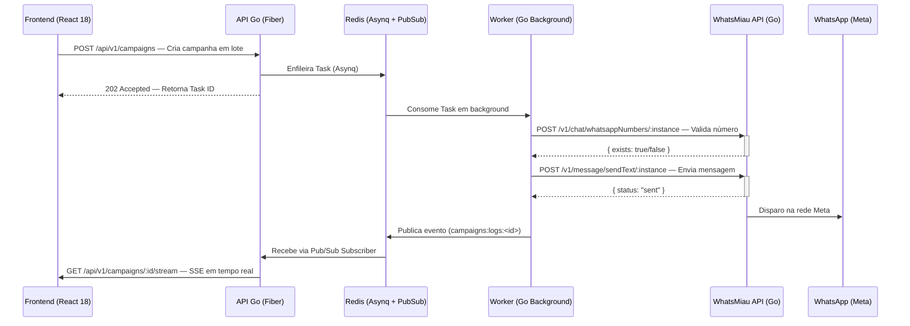
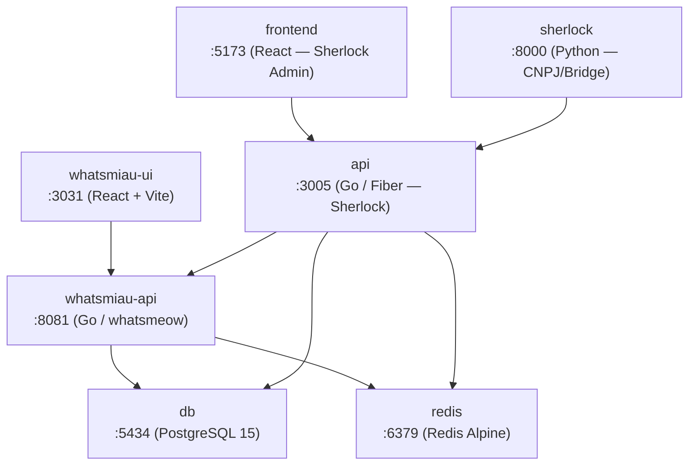

# WhatsMiau — CRM Inteligente para Prospecção B2B via WhatsApp

<div align="center">

[](https://golang.org)
[](https://reactjs.org)
[](https://www.typescriptlang.org)
[](https://www.postgresql.org)
[](https://redis.io)
[](https://www.docker.com)
[](https://tailwindcss.com)
[](https://www.framer.com/motion)
[](LICENSE)
[](.)

**Prospecção automatizada · Disparos em lote · Dossiê IA · Chat multicanal · Dashboard analítico**

</div>

---

## 📑 Índice

- [Visão Geral](#-visão-geral)
- [Arquitetura do Sistema](#️-arquitetura-do-sistema)
- [Funcionalidades Principais](#-funcionalidades-principais)
- [Design System](#-design-system)
- [Tech Stack](#️-tech-stack)
- [Pré-requisitos](#️-pré-requisitos)
- [Instalação e Execução](#-instalação-e-execução)
- [Estrutura de Diretórios](#-estrutura-de-diretórios)
- [Fluxo de Uso Básico](#-fluxo-de-uso-básico)
- [Capturas de Tela](#️-capturas-de-tela)
- [API](#-api)
- [Troubleshooting](#-troubleshooting)
- [Contribuição](#-contribuição)
- [Licença](#-licença)

---

## 📌 Visão Geral

O **WhatsMiau + Sherlock Scraper** é um ecossistema SaaS de CRM B2B voltado à prospecção e qualificação automatizada de leads via WhatsApp. O sistema integra dois serviços principais:

| Serviço | Responsabilidade |
|---------|-----------------|
| **Sherlock Scraper** (Backend Go / Fiber) | Raspagem de leads no Google Maps, enriquecimento de dados via IA (Gemini), geração de dossiês, orquestração de campanhas assíncronas (Asynq + Redis) e streaming de eventos em tempo real (SSE) |
| **WhatsMiau** (Frontend React + API Go) | Painel CRM completo: chat multicanal, kanban de leads, gestão de equipe, instâncias WhatsApp, automações e dashboard analítico com design system verde premium |

> **Redesign recente:** O painel passou por uma revisão completa de design system, adotando a paleta verde WhatsMiau (`#00af4b`), glassmorphism em cards, microinterações com Framer Motion e tipografia Inter premium.

---

## 🏗️ Arquitetura do Sistema

### Fluxo Principal — Campanhas Assíncronas



### Fluxo de Inteligência Artificial — Dossiê de Leads

```mermaid
flowchart LR
    A([Google Maps Scraper]) -->|URL + Dados brutos| B[Google Places API]
    B -->|Rating, Reviews, Endereço| C[Playwright — Site Scraper]
    C -->|Texto do site| D[Gemini AI — Extração de Insights]
    D -->|BusinessInsights JSON| E[(PostgreSQL — LeadDeepData)]
    E -->|Dados enriquecidos| F[Dossier Service]
    F -->|Prompt estruturado| G[Gemini AI — Geração do Dossiê]
    G -->|Maturidade digital, Gaps, Icebreakers, Pitches, Objeções| H([Frontend — LeadDetailsModal])
```



### Mapa de Serviços Docker



---

## ✨ Funcionalidades Principais

### 🔍 Prospecção e Leads
- **Scraping automatizado no Google Maps** com enriquecimento via Google Places API (rating, avaliações, endereço, website)
- **Scraping de sites empresariais** com Playwright para extração de conteúdo real
- **Dossiê IA por lead** gerado com Google Gemini, incluindo:
  - Score de maturidade digital (0–100) com gauge circular
  - Gaps e oportunidades identificados
  - Icebreakers personalizados para abordagem
  - Pitches de venda contextualizados
  - Contorno de objeções específicas
- **Kanban de leads** com drag-and-drop (`@hello-pangea/dnd`)
- **Bulk Send Modal** — disparo em lote com validação prévia de números WhatsApp

### 💬 Chat Multicanal
- Interface de chat completa com `ChatList`, `MessageThread`, `ContactProfile`
- Suporte a reações em mensagens
- Agendamento de mensagens (`ScheduleModal`)
- Templates de respostas rápidas
- Painel de contato retrátil com histórico e tags
- Múltiplas instâncias WhatsApp simultâneas

### 📊 Dashboard e Monitoramento
- Dashboard analítico com glassmorphism e `Chart.js`
- Monitoramento em tempo real: incidentes, auditoria, logs ao vivo (SSE)
- `CampaignProgressBadge` — badge flutuante de progresso de campanha ativa
- Notificações via `HandoffSSE` — eventos de handoff em tempo real

### ⚙️ Administração
- **Super Admin:** gestão de empresas, usuários e instâncias globais
- **Admin:** setores, tags, webhook, kanban, quick replies, flows de automação, Sherlock integration, API docs
- Gestão de permissões por role (`super_admin`, `admin`, `user`)
- Configuração de webhook com logs detalhados

---

## 🎨 Design System

### Paleta de Cores — Verde WhatsMiau

| Token | Valor | Uso |
|-------|-------|-----|
| `whatsapp-500` / `primary-500` | `#00af4b` | Cor primária, CTAs, ícones ativos |
| `whatsapp-400` | `#33bf6f` | Hover states |
| `whatsapp-600` | `#008c3c` | Estados pressionados |
| `whatsapp-50` | `#e6f7ed` | Backgrounds suaves |

### Animações (Tailwind + Framer Motion)

```js
// tailwind.config.js — keyframes nativos
animation: {
  'fade-in':   'fadeIn 0.3s ease-in-out',
  'slide-up':  'slideUp 0.3s ease-out',
  'slide-down':'slideDown 0.3s ease-out',
  'scale-in':  'scaleIn 0.2s ease-out',
}
```

- **Framer Motion v10** para animações de entrada/saída de modais, drawers e cards
- **Glassmorphism:** `backdrop-blur` em painéis laterais e cards de insight
- **Dark mode** nativo via classe (`darkMode: 'class'`)
- **Tipografia:** Inter (sans-serif) em pesos 400–700

> 🤖 **Design assistido por IA:** O design system foi refinado com auxílio do **Claude Code** e a skill **ui-ux-pro-max**, que fornece paletas, tipografias, estilos e padrões de componentes premium para acelerar decisões de UI/UX.

### Componentes Premium
| Componente | Descrição |
|-----------|-----------|
| `LeadDetailsModal` | Drawer lateral expansível com dossiê IA completo |
| `LeadsKanban` | Board drag-and-drop com colunas de funil |
| `CampaignProgressBadge` | Badge flutuante de progresso com SSE |
| `QRCodeModal` | Modal de conexão de instância WhatsApp via QR |
| `ScheduleModal` | Agendamento de mensagens com date picker |
| `ContactProfile` | Painel retrátil de perfil de contato no chat |

---

## 🛠️ Tech Stack

| Camada | Tecnologia | Versão | Descrição |
|--------|-----------|--------|-----------|
| **API Principal** | Go (Fiber v2) | 1.25 / v2.52 | Framework HTTP performático com tipagem forte |
| **Gateway WhatsApp** | Go (whatsmeow) | — | Motor WhatsApp nativo sem Puppeteer |
| **Filas / Background** | Asynq | v0.26 | Orquestração de jobs transacionais via Redis |
| **Pub/Sub / Cache** | Redis | Alpine | Backing do Asynq e barramento SSE |
| **Banco de Dados** | PostgreSQL + GORM | 15 / v1.31 | Persistência relacional com ORM expressivo |
| **IA Generativa** | Google Gemini | v0.18 | Dossiê de leads, insights e icebreakers |
| **Web Scraping** | Playwright Go | v0.47 | Extração de conteúdo de sites empresariais |
| **Frontend CRM** | React + Vite | 18.2 / 5.0 | SPA reativa com TypeScript 5.2 |
| **Estilização** | Tailwind CSS | 3.3 | Utility-first com design tokens customizados |
| **Animações** | Framer Motion | 10 | Microinterações e transições premium |
| **Gráficos** | Chart.js + react-chartjs-2 | 4.4 | Dashboard analítico |
| **Drag & Drop** | @hello-pangea/dnd | 16.6 | Kanban de leads |
| **Alertas UI** | SweetAlert2 | 11.26 | Modais de confirmação branded |
| **Scrapers auxiliares** | Python + Playwright | 3.x | CNPJ scraper e bridge API |
| **Containerização** | Docker Compose | v2.x | Orquestração completa de 7 serviços |

---

## ⚙️ Pré-requisitos

- **Docker Engine** `24.x+`
- **Docker Compose** `v2.x+`
- Chaves de API:
  - Google Gemini (`GEMINI_API_KEY`)
  - Google Places (`GOOGLE_PLACES_API_KEY`)

---

## 🚀 Instalação e Execução

### 1. Clone o repositório

```bash
git clone https://github.com/moacir1neto/sherlock-scraper.git
cd sherlock-scraper
```

### 2. Configure as variáveis de ambiente

```bash
cp .env.example .env
```

Edite o `.env` na raiz e em `backend/.env`:

```env
# .env (raiz) — Chaves de API externas
GEMINI_API_KEY=sua_chave_gemini_aqui
GOOGLE_PLACES_API_KEY=sua_chave_google_places_aqui
```

```env
# backend/.env — Integração WhatsMiau
WHATSMIau_API_URL=http://whatsmiau-api:8080
WHATSMIau_API_TOKEN=seu_token_de_api_aqui
INTERNAL_API_TOKEN=seu_token_interno_aqui
```

### 3. Suba todos os serviços

```bash
docker compose up -d --build
```

Serviços disponíveis após inicialização:

| Serviço | URL |
|---------|-----|
| WhatsMiau UI (Painel Principal) | http://localhost:3031 |
| Sherlock Admin Frontend | http://localhost:5173 |
| Sherlock API (Go/Fiber) | http://localhost:3005 |
| WhatsMiau API (Go/whatsmeow) | http://localhost:8081 |
| Sherlock Scraper (Python) | http://localhost:8000 |
| PostgreSQL | localhost:5434 |
| Redis | localhost:6379 |

### 4. Gere as credenciais de administrador

```bash
# Cria usuário super admin interativo (produção)
docker compose exec api go run cmd/seed/main.go

# Ou use os scripts de conveniência (whatsmeow/)
./whatsmeow/create-dev-users.sh   # dev: superadmin, admin, user (senha: admin123)
./whatsmeow/create-super-admin.sh # produção: define nome, email e senha
```

### 5. Acesse o painel

Abra **http://localhost:3031** e faça login com as credenciais criadas.

---

## 📁 Estrutura de Diretórios

```text
sherlock-scraper/
├── backend/                        # Sherlock — API Go (Fiber)
│   ├── cmd/
│   │   ├── api/                    # Entrypoint HTTP principal
│   │   └── seed/                   # Scripts de seed e DML
│   ├── internal/
│   │   ├── core/                   # Entidades de domínio (interfaces, ports)
│   │   ├── database/               # Configuração e migrations GORM
│   │   ├── handlers/               # Endpoint handlers Fiber
│   │   ├── middlewares/            # JWT, logger, rate-limit
│   │   ├── queue/                  # Workers Asynq
│   │   │   ├── tasks.go            # Definição de tasks e processadores
│   │   │   ├── dossier_service.go  # Serviço de geração de dossiê IA (Gemini)
│   │   │   ├── google_scraper.go   # Scraper Google Maps + Places API
│   │   │   ├── social_scraper.go   # Scraper de redes sociais e sites
│   │   │   ├── dossier_processor.go
│   │   │   ├── redis.go            # Pub/Sub publisher
│   │   │   ├── server.go           # Configuração do servidor Asynq
│   │   │   ├── helpers.go          # Utilitários compartilhados
│   │   │   └── client.go           # Cliente Asynq
│   │   ├── repositories/           # Camada de acesso a dados
│   │   ├── services/               # Casos de uso de aplicação
│   │   └── sse/                    # Server-Sent Events
│   │       ├── hub.go              # Hub central de conexões SSE
│   │       ├── redis_broadcaster.go # Subscriber Redis → SSE
│   │       └── composite.go        # Broadcaster composto
│   └── pkg/
│       ├── csvparser/              # Parser de leads via CSV
│       └── phoneutil/              # Normalização de números BR
│
├── whatsmeow/                      # WhatsMiau — Gateway WhatsApp + CRM
│   ├── main.go                     # Entrypoint API whatsmeow
│   ├── models/                     # Modelos de domínio (Lead, Contact, Message...)
│   ├── repositories/               # Repositórios de dados
│   ├── services/                   # Lógica de negócio (chat, instâncias, campanhas)
│   ├── server/                     # Configuração HTTP e rotas
│   ├── lib/                        # Bibliotecas internas
│   └── frontend/                   # Painel WhatsMiau (React + Vite)
│       └── src/
│           ├── App.tsx             # Roteamento principal
│           ├── pages/
│           │   ├── Chat.tsx        # Chat multicanal
│           │   ├── Dashboard.tsx   # Dashboard analítico
│           │   ├── Leads/          # CRM de leads + dossiê IA
│           │   │   ├── index.tsx           # Lista e filtros
│           │   │   ├── LeadDetailsModal.tsx # Drawer com dossiê IA
│           │   │   ├── BulkSendModal.tsx    # Disparo em lote
│           │   │   ├── LeadsKanban.tsx      # Board Kanban
│           │   │   └── LeadStatusBadge.tsx
│           │   ├── Sherlock/       # Integração Sherlock Scraper
│           │   ├── Instances.tsx   # Gestão de instâncias WhatsApp
│           │   ├── Monitoramento.tsx # Incidentes, auditoria, logs ao vivo
│           │   ├── Admin.tsx       # Painel administrativo
│           │   └── SuperAdmin.tsx  # Painel super admin
│           └── components/
│               ├── layout/
│               │   ├── Sidebar.tsx # Navegação lateral
│               │   └── Topbar.tsx  # Barra superior com notificações
│               └── chat/
│                   ├── ChatList.tsx        # Lista de conversas
│                   ├── MessageThread.tsx   # Thread de mensagens
│                   ├── ContactProfile.tsx  # Painel retrátil de contato
│                   ├── MessageItem.tsx     # Item de mensagem com reações
│                   └── ScheduleModal.tsx   # Agendamento de mensagens
│
├── main.py                         # Scraper Python principal (Google Maps)
├── cnpj_scraper.py                 # Scraper de CNPJ
├── bridge_api.py                   # Bridge HTTP Python → Go
├── requirements.txt                # Dependências Python
├── docker-compose.yml              # Orquestração completa (7 serviços)
├── Dockerfile                      # Imagem Python scraper
└── .env.example                    # Template de variáveis de ambiente
```

---

## 🔄 Fluxo de Uso Básico

```text
1. Prospecção
   └── Admin > Sherlock > Busca no Google Maps por nicho/localidade
       └── Sistema scrapa leads, enriquece com Google Places e IA

2. Análise do Lead
   └── Admin > Leads > Clique no lead > Abre LeadDetailsModal
       └── Visualiza dossiê: score de maturidade, gaps, icebreakers

3. Disparo de Campanha
   └── Admin > Leads > Seleciona leads > Bulk Send Modal
       └── Sistema valida números → Enfileira no Asynq → Dispara via WhatsMiau
       └── Progresso visível no CampaignProgressBadge (SSE tempo real)

4. Acompanhamento no Chat
   └── Chat > Conversa iniciada automaticamente após resposta do lead
       └── Use ContactProfile para ver histórico, tags e atribuir ao setor

5. Dashboard
   └── Dashboard > Métricas de campanhas, conversões e atividade por instância
```

---

## 🖼️ Capturas de Tela

Telas pendentes de captura — salve em `docs/screenshots/` e descomente:

- [ ] **Lista de Leads** — glassmorphism cards, filtros, badges de status e botão de dossiê IA
  <!--  -->
- [ ] **Drawer Dossiê IA** — LeadDetailsModal expandido (3 colunas: score maturidade, icebreakers, pitches)
  <!--  -->
- [ ] **Dashboard** — cards glassmorphism, gráficos Chart.js, métricas em tempo real
  <!--  -->
- [ ] **Chat** — interface multicanal com painel de contato retrátil
  <!--  -->
- [ ] **Kanban** — board drag-and-drop com colunas de funil
  <!--  -->

---

## 🔌 API

A documentação interativa da API está disponível em:

- **Sherlock API:** `http://localhost:3005/api/v1` (endpoints Go/Fiber)
- **WhatsMiau API:** `http://localhost:8081` (endpoints Go/whatsmeow)
- **Painel API Docs:** `http://localhost:3031/admin/api` (documentação interna no frontend)

Principais grupos de endpoints da Sherlock API:

| Grupo | Prefixo | Descrição |
|-------|---------|-----------|
| Autenticação | `/api/v1/auth` | Login, refresh token |
| Leads | `/api/v1/leads` | CRUD, importação CSV, dossiê IA |
| Campanhas | `/api/v1/campaigns` | Criação, streaming SSE |
| Instâncias | `/api/v1/instances` | Gerenciamento de instâncias WhatsApp |
| Workers | `/api/v1/queue` | Status de tasks Asynq |

---

## 🔧 Troubleshooting

| Problema | Causa provável | Solução |
|----------|---------------|---------|
| Porta `3031` ou `3005` já em uso | Container anterior rodando | `docker compose down && docker compose up -d` |
| Redis não conecta / timeout | Container Redis parado | `docker compose ps redis` → se parado: `docker compose up -d redis` |
| Erro `GEMINI_API_KEY not set` | Variável ausente no `.env` | Verificar `GEMINI_API_KEY` no `.env` raiz e em `backend/.env` |
| Vite HMR não conecta (WebSocket) | Acesso via HTTPS ou IP externo | Acessar via `http://localhost:3031` (sem HTTPS) |
| Build quebrado após atualização | Cache de layers Docker desatualizado | `docker compose build --no-cache && docker compose up -d` |
| Migrations não rodam | Banco não está healthy | `docker compose logs db` → aguardar healthcheck passar |
| Dossiê IA retorna vazio | Chave Gemini inválida ou quota excedida | Validar chave em [Google AI Studio](https://aistudio.google.com) |

---

## 🤝 Contribuição

Contribuições são bem-vindas! Siga o processo abaixo:

1. Faça um fork do repositório
2. Crie uma branch descritiva: `git checkout -b feat/minha-feature`
3. Implemente seguindo os princípios **SOLID**, **DRY** e **Clean Code**
4. Escreva testes para as alterações críticas
5. Abra um Pull Request com descrição clara do problema e solução

### Padrões do Projeto

- **Go (Backend):** Separação em `handlers → services → repositories → core`
- **React (Frontend):** Componentes pequenos, hooks customizados, contexts para estado global
- **Commits:** Conventional Commits (`feat:`, `fix:`, `refactor:`, `docs:`)

### Reportar Issues

Use o [GitHub Issues](../../issues) para reportar bugs, com:
- Versão do sistema
- Passos para reproduzir
- Comportamento esperado vs. atual
- Logs relevantes (`docker compose logs api`)

---

## 📄 Licença

Distribuído sob a licença **MIT**. Veja [`LICENSE`](LICENSE) para detalhes.

---

<div align="center">

Feito com ❤️ pelo time **WhatsMiau + Sherlock**

[](https://golang.org)
[](https://reactjs.org)
[](https://deepmind.google/technologies/gemini)

</div>
