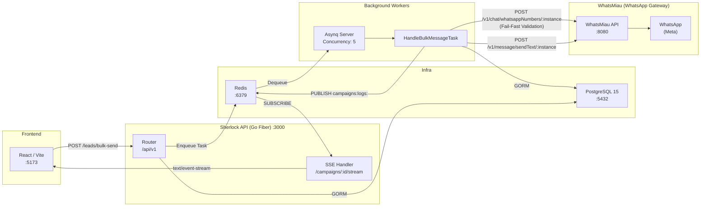

# Sherlock Scraper


Plataforma B2B de prospecção ativa que combina scraping automatizado (Google Maps, Casa dos Dados), análise de leads por IA (Google Gemini) e **disparo de mensagens em massa via WhatsApp** com orquestração em filas Redis. O motor de campanhas roda em background, valida números na rede Meta antes do envio e entrega logs em tempo real para o frontend via SSE.

---

## Arquitetura



---

## Features

- **Motor de Campanhas em Background** — Workers Asynq processam filas com concorrência configurável (critical/default/low) e retry automático.
- **Fail-Fast Validation** — Cada número é verificado na rede Meta (`/v1/chat/whatsappNumbers`) antes do envio. Números inexistentes são marcados como `Perdido` e a task cancelada sem retry.
- **Isolamento do Core** — O worker consome a WhatsMiau API exclusivamente via HTTP. Nenhum código da pasta `/whatsmeow` é alterado.
- **Streaming SSE** — Endpoint `GET /api/v1/campaigns/:id/stream` retransmite eventos Redis Pub/Sub (`campaigns:logs:<id>`) para o frontend em tempo real.
- **Heartbeat 30s** — Mantém a conexão SSE viva em proxies reversos e load balancers.
- **Scraping Automatizado** — Google Maps via Playwright + CNPJ via Casa dos Dados (bridge Python).
- **Deep Enrichment** — Extração de redes sociais, Facebook Pixel, GTM e Google Reviews por lead.
- **Análise de IA** — Google Gemini gera icebreakers personalizados por lead para prospecção.
- **Kanban Automation** — Redis Pub/Sub (`whatsapp:messages:received`) move leads automaticamente ao receber mensagem WhatsApp.
- **Pipeline Customizável** — Criação de pipelines e estágios sob medida, incluindo geração por IA.

---

## Tech Stack

| Camada | Tecnologia | Função |
|:---|:---|:---|
| **API** | Go 1.25 + Fiber v2 | Backend RESTful, JWT Auth (HS256), CORS |
| **ORM** | GORM + pgx | Modelagem relacional, JSONB, AutoMigrate |
| **Fila** | Asynq + Redis | Enqueue/dequeue de tasks (enrich, bulk-message) |
| **Mensageria** | Redis Pub/Sub | Eventos de campanha e Kanban em tempo real |
| **Streaming** | SSE (fasthttp) | Entrega de logs para o frontend |
| **WhatsApp** | WhatsMiau (Whatsmeow) | Gateway WhatsApp Web multi-instância |
| **IA** | Google Gemini (generative-ai-go) | Análise e icebreaker para leads |
| **Scraper** | Python + Playwright | Google Maps + Casa dos Dados |
| **Frontend** | React 18 + Vite + TypeScript | SPA com Kanban, CSV Upload, Streaming |
| **Banco** | PostgreSQL 15 | Persistência de leads, pipelines, settings |
| **Infra** | Docker Compose | Orquestração de 6 serviços |

---

## Pré-requisitos

- [Docker Engine](https://docs.docker.com/engine/install/) `>= 24.x`
- [Docker Compose](https://docs.docker.com/compose/) `>= v2.x`

Nenhuma instalação local de Go, Node.js ou Python é necessária.

---

## Instalação

### 1. Clone e configure

```bash
git clone <seu-repositorio>
cd sherlock-scraper
cp .env.example .env
```

### 2. Variáveis de Ambiente

As variáveis críticas estão no `docker-compose.yml` e nos arquivos `.env`:

| Variável | Onde | Descrição |
|:---|:---|:---|
| `DATABASE_URL` | docker-compose.yml | Connection string do PostgreSQL |
| `JWT_SECRET` | docker-compose.yml | Chave secreta para assinatura JWT |
| `REDIS_ADDR` | docker-compose.yml | Endereço do Redis (`redis:6379`) |
| `WHATSMIau_API_URL` | docker-compose.yml | URL da API WhatsMiau (`http://whatsmiau-api:8080`) |
| `WHATSMIau_API_TOKEN` | docker-compose.yml | Token de autenticação da API WhatsMiau |
| `INTERNAL_API_TOKEN` | docker-compose.yml | Token para comunicação server-to-server |
| `GEMINI_API_KEY` | .env (raiz) | Chave da API Google Gemini |
| `GOOGLE_PLACES_API_KEY` | .env (raiz) | Chave da API Google Places |

### 3. Build e Start

```bash
docker compose up -d --build
```

Na primeira execução, crie o usuário admin:

```bash
docker compose exec api go run cmd/seed/main.go
```

### 4. Acesse

| Serviço | URL |
|:---|:---|
| **Sherlock CRM** | [http://localhost:5173](http://localhost:5173) |
| **Sherlock API** | [http://localhost:3000/api/v1](http://localhost:3000/api/v1) |
| **WhatsMiau API** | [http://localhost:8081](http://localhost:8081) |
| **WhatsMiau UI** | [http://localhost:3031](http://localhost:3031) |
| **PostgreSQL** | `localhost:5432` |

---

## Estrutura de Diretórios

```
sherlock-scraper/
├── backend/
│   ├── cmd/
│   │   ├── api/main.go              # Entrypoint — Fiber + DI + Workers
│   │   └── seed/main.go             # Seeder admin
│   ├── internal/
│   │   ├── core/
│   │   │   ├── domain/              # Entidades (Lead, User, Pipeline, Setting)
│   │   │   └── ports/               # Interfaces (repositórios, broadcasters)
│   │   ├── database/                # Conexão GORM, AutoMigrate
│   │   ├── handlers/                # Controllers HTTP (Auth, Lead, Scrape, AI, SSE)
│   │   │   ├── campaign_sse_handler.go   # SSE streaming de campanhas
│   │   │   └── redis_subscriber.go       # Subscriber Kanban automation
│   │   ├── middlewares/             # JWT Auth, Internal Token
│   │   ├── queue/                   # Motor Asynq (client, server, tasks, redis pub/sub)
│   │   │   ├── client.go            # Asynq client init
│   │   │   ├── server.go            # Asynq server + mux handlers
│   │   │   ├── tasks.go             # HandleBulkMessageTask, HandleEnrichLeadTask
│   │   │   └── redis.go             # Redis publisher (campaigns:logs)
│   │   ├── repositories/            # Acesso ao banco (GORM)
│   │   ├── services/                # Lógica de negócio (Auth, Lead, AI, Kanban)
│   │   └── sse/                     # Hub in-memory + RedisBroadcaster
│   └── pkg/
│       ├── csvparser/               # Parser de CSV
│       └── phoneutil/               # Normalização de telefone para WhatsApp
├── frontend/                        # SPA React/Vite (TypeScript)
├── whatsmeow/                       # WhatsMiau — Gateway WhatsApp (subprojeto)
├── main.py                          # Scraper Python (Google Maps)
├── bridge_api.py                    # Bridge API (Casa dos Dados / CNPJ)
├── docker-compose.yml               # Orquestração de 6 serviços
└── README.md
```

---

## Endpoints da API

Rotas protegidas exigem `Authorization: Bearer <token>`.

### Auth
| Método | Rota | Auth |
|:---|:---|:---|
| `POST` | `/api/v1/auth/register` | ❌ |
| `POST` | `/api/v1/auth/login` | ❌ |

### Campanhas (Disparo em Massa)
| Método | Rota | Auth | Descrição |
|:---|:---|:---|:---|
| `POST` | `/api/v1/leads/bulk-send` | ❌ | Enfileira leads para disparo |
| `GET` | `/api/v1/campaigns/:id/stream` | ❌ | SSE — logs da campanha em tempo real |

### Leads
| Método | Rota | Auth |
|:---|:---|:---|
| `GET` | `/api/v1/protected/leads` | ✅ |
| `POST` | `/api/v1/protected/leads` | ✅ |
| `POST` | `/api/v1/protected/leads/upload` | ✅ |
| `PATCH` | `/api/v1/protected/leads/:id/status` | ✅ |
| `PUT` | `/api/v1/protected/leads/:id` | ✅ |
| `DELETE` | `/api/v1/protected/leads/:id` | ✅ |

### IA & Enrichment
| Método | Rota | Auth |
|:---|:---|:---|
| `POST` | `/api/v1/protected/leads/:id/analyze` | ✅ |
| `GET` | `/api/v1/protected/leads/:id/analysis` | ✅ |
| `POST` | `/api/v1/protected/leads/analyze/bulk` | ✅ |
| `POST` | `/api/v1/protected/leads/:id/enrich-cnpj` | ✅ |
| `POST` | `/api/v1/protected/leads/:id/validate-cnpj` | ✅ |

### Pipeline & Settings
| Método | Rota | Auth |
|:---|:---|:---|
| `GET` | `/api/v1/protected/pipeline` | ✅ |
| `POST` | `/api/v1/protected/pipeline` | ✅ |
| `GET` | `/api/v1/protected/settings` | ✅ |
| `PUT` | `/api/v1/protected/settings` | ✅ |

### SSE & Scraping
| Método | Rota | Auth |
|:---|:---|:---|
| `GET` | `/api/v1/events/kanban` | JWT via query |
| `POST` | `/api/v1/protected/scrape` | ✅ |
| `GET` | `/api/v1/protected/scrapes` | ✅ |

### Internal (Server-to-Server)
| Método | Rota | Auth |
|:---|:---|:---|
| `POST` | `/api/v1/internal/scrape-sync` | `X-Internal-Token` |
| `POST` | `/api/v1/internal/scrape-start` | `X-Internal-Token` |
| `GET` | `/api/v1/internal/scrape-status/:job_id` | `X-Internal-Token` |

---

*Sherlock Scraper — Prospecção automatizada com precisão cirúrgica.* 🔎
